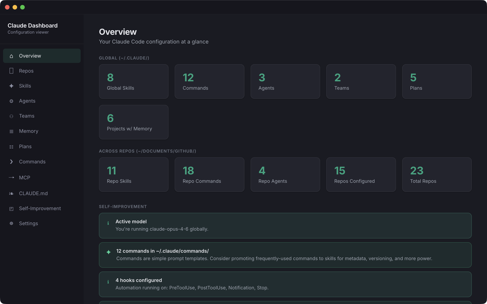

# Claude Code Dashboard

A desktop app that gives you a visual command center for your entire [Claude Code](https://docs.anthropic.com/en/docs/claude-code) setup. It reads your `~/.claude/` directory and scans your repos, then shows everything in one place: skills, agents, commands, memory, permissions, MCP servers, plans, teams, and usage insights.

**[Download the latest DMG](https://github.com/tjamjam/claude-code-dashboard/releases/latest)** (macOS, Apple Silicon)



## What it does

- **Overview dashboard** with global and per-repo stats, model detection, and self-improvement insights
- **Permission matrix** showing the status of all 15 built-in tools (Allowed, Denied, Prompts you)
- **Repo scanner** that finds every repo in your GitHub directory, shows its Claude config, and detects running dev servers
- **Browsers for skills, agents, commands, plans, memory, and teams**, both global and per-repo
- **MCP server viewer** with connection type, permission scope, and plugin details
- **CLAUDE.md viewer** for your global instructions
- **Usage insights** from `/insights` reports
- **Copy-paste prompts** on every page, tailored to your current context, for creating, auditing, and improving your setup

## Install

### Direct download

Grab the `.dmg` from the [latest release](https://github.com/tjamjam/claude-code-dashboard/releases/latest), open it, and drag to Applications. The DMG is signed, notarized, and works on macOS 12+ (Intel and Apple Silicon).

### Build from source

```bash
git clone https://github.com/tjamjam/claude-code-dashboard.git
cd claude-code-dashboard
npm install
npm run dev          # Development with hot reload
npm run package:dmg  # Build a signed DMG
```

## How it works

This is a three-process Electron app:

- **Main process** (`src/main/index.js`) reads your filesystem via IPC handlers. All data access happens here.
- **Preload** (`src/preload/index.js`) exposes a minimal bridge: `window.api.invoke()` and `window.api.openExternal()`.
- **Renderer** (`src/renderer/`) is a React app that fetches everything through the `useApi` hook. No direct filesystem access.

The app reads from `~/.claude/` (global config) and `~/Documents/GitHub/` (repos). In the Mac App Store version, these paths are granted via folder picker dialogs with security-scoped bookmarks.

## Privacy

No analytics, no telemetry, no network requests, no accounts. Everything stays on your machine. [Full privacy policy](https://tjamjam.github.io/claude-code-dashboard/privacy.html).

## License

MIT
